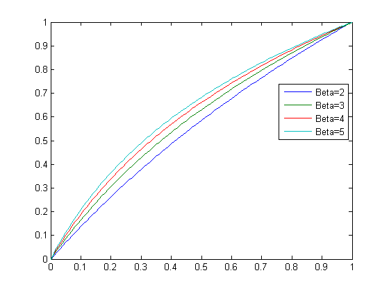
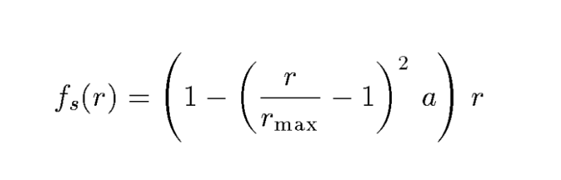
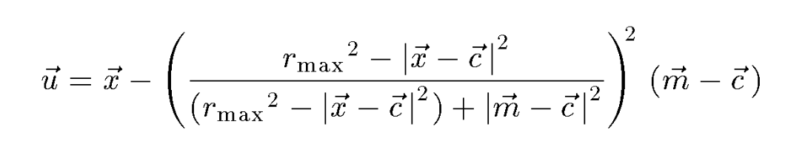

# Face-beautification

《数字媒体(2)：多媒体》课程中音频小课堂大作业-人脸美化任务

## 项目概述

在该项目中，我们完成了一个可以运行在Android手机上的美颜APP，总体实现了以下功能

- 可以高效实现美白、磨皮、口红、大眼、瘦脸效果
- 可以自由调节美颜程度以及组合美颜效果
- 支持自选图片—拍照/本地图库
- 支持保存图片到本地

## 工程实现

### 人脸关键点获取

每当获取到一张图片的时候，我们需要调用Face++提供的Web
API来获得稠密关键点，这一步用web请求，需要将数据处理成需要的格式并且图片大小不能超过2MB（必要的时候需进行压缩，例如摄像头拍摄获得的照片通常情况下都需要压缩），为了防止网络波动造成调用错误，我们进行最多三次的重试。三次过后仍然获得不到正常的调用结果则返回未检测到人脸/网络错误。

### UI交互

UI界面方面我们整体上参考了著名美颜APP B612的设计，最下方可以选择美颜效果，然后上方有一个滑动条来控制美颜程度的大小（也就是$level$，我们认为其是一个[0,100]
范围内的整数），拖动的同时上方会显示美颜的结果。因此对算法延迟提出了比较高的要求。首先肯定不能进度条每动一次就重新渲染，这样会导致很多无谓的计算和卡顿。我们采用的方法是使用了一个计时器，每隔100毫秒刷新一次，如果检测到用户在上一个100毫秒没有再次拖动进度条并且上在这期间没有进行渲染，那么我们根据用户对每个美颜效果设置的程度进行一次完整的渲染，从而达到一个伪实时的效果。

## 算法实现

考虑到手机的算力、平台限制以及效率的要求，我们使用的算法均为传统方法。

### 人脸检测

我们选择了Face++提供的Web API稠密关键点[[4]](#4) 为我们的算法提供人脸轮廓及其细节（包括鼻子、嘴唇、眼睛等）的定位。

### 美白

参考[[6]](#6)中的方法，构造一个映射，使得原图在色阶上有所增强，并且在亮度两端增强得稍弱，中间增强得稍强。记$v(x,y)$为美白后的亮度水平（这里的亮度水平均用[0,1]上的数表示）， $w(x,y)$ 为原来的亮度水平，$\beta$ 表示美白的程度，亮度转换函数如下：$v(x,y)=\frac{log(w(x,y)\times(\beta -1)+1}{log\beta}$

下图为不同$\beta$值下的亮度转换曲线，$\beta$越大美白效果越强。

美白的话需要$\beta>1$，实际实现中将$\beta$进行了偏移和缩放，其与美颜程度$level$的对应关系为：$\beta = 0.02 \times level +1 $。

### 磨皮

我们首先用Java版的OpenCV实现了[[1]](#1)中所介绍的算法，其算法步骤为：

- 对原图层`image`进行双边滤波，结果存入`temp1`图层中
- 将`temp1`图层减去原图层`image`，将结果存入`temp2`图层中
- 对`temp2`图层进行高斯滤波，结果存入`temp3`图层中
- 以原图层`image`为基色，以`temp3`图层为混合色，将两个图层进行线性光混合得到图层`temp4`
- 考虑不透明度，修正上一步的结果，得到最终图像`dst`

实现之后发现由于移动端计算力不足以及Java版OpenCV本身速度受限的问题，在双边滤波的域核和值域核都选取较小的情况，单单一个磨皮就要运行15秒，而且效果还不明显。而我们调研了其他磨皮算法[[2]](#2)
，基本也都是基于滤波来实现的，如果我们用原生的Java版的OpenCV接口肯定无法达到效率上的要求。后来我们幸运地发现了一个Android端磨皮的开源实现[[3]](#3)
，其思路是频域分离的方法，将图像转换到频域用高通滤波器区分出高低频，再通过对图像的某些频率进行调整来使图像平滑，并同时能够保持较高的细节水平。经过使用我们发现其效率和效果均满足我们的要求，因此我们在工程中引入了该实现，将其作为我们最终的磨皮算法。

### 口红

由于Face++的API返回结果中已经包括了嘴唇的边界（分为上下两部分），因此我们可以直接根据提供的轮廓点圈出嘴唇所在的区域。因为已经领略了OpenCV的速度，因此我们在口红的实现上使用了与Android特有图片存储格式Bitmap配合良好的Canvas组件，可以方便地让我们对原Bitmap进行操作（修改、选区、上色等）。

出于方便，我们仅考虑红色的口红，也就是给嘴唇区域上红色。我们采用了Painter对嘴唇所在区域进行上红色，然后边缘加模糊，再与原图层进行叠加。经过尝试，我们R通道的数值定为 $80 + 1.4 \times level$ ，其中 $level\in [1,100]$ ，为口红的程度。

### 大眼

大眼算法中我们选择的是文章Interactive Image Warping[[5]](#5)
中提出的局部缩放变换。它可以对一个圆形区域进行平滑缩放。放大的思路是将距离圆心远的点平滑映射到距离圆心近的点，然后用它的像素值进行替换（其实本质和gamma矫正也类似），映射的公式为：（其中 $\alpha \in [-1,1]$ 越大放大效果越明显，负值是缩小）

经过不断的尝试，我们选择了眼珠的中心作为圆心，然后三倍眼珠子大小（都由Face++的API提供）作为半径，美颜程度来控制 $\alpha$ ，具体的对应关系为：$\alpha = \frac{level}{200}$

### 瘦脸

瘦脸算法我们选择了同一篇文章Interactive Image Warping[^5] 中提出的局部平移变换。它需要指定一个变换原点 $c$ ，一个目标位置 $m$ ，以及一个指定变换距离 $r_{max}$ ，最终效果并不是将原点变换到目标位置，而是将该点平移到目标位置方向 $r_{max}$ 距离处，并保持其他地方的变化平滑而不显得十分突兀。其变换公式为：

经过不断的尝试，我们选择了从下巴到耳朵的轮廓中最中间那个点作为变换原点，鼻子中心作为目标位置， $r_{max}$ 设定为像素值（与脸大小、图片分辨率大小以及美颜程度 $level$ 有关），最终经过不断调整 $r_{max}=(180 +\frac{level}{2})\times \frac{FaceDiagonalLength}{1131}$ ，其中$FaceDiagonalLength是计算得到的脸的bounding box的对角线长度。

## 创新点

本次作业中，我们认为**在Android端实现可应用的/高效的APP**
是我们最大的创新点，也是我们的工作区别于其他选择相同任务的小组的地方。这一选择带给了我们小组一些不一样的挑战，同时也使得我们的成果更可能应用到实践中去，大大提升了算法的可应用性，真正让我们领略到美颜算法的效果。

## 参考资料

<a id="1">[1]</a>
https://blog.csdn.net/zhangqipu000/article/details/53260647

<a id="2">[2]</a>
https://blog.csdn.net/trent1985/article/details/50496969

<a id="3">[3]</a>
https://github.com/msoftware/HighPassSkinSmoothing-Android

<a id="4">[4]</a>
https://console.faceplusplus.com.cn/documents/55107022

<a id="5">[5]</a>
http://www.gson.org/thesis/warping-thesis.pdf

<a id="6">[6]</a>
Tai S C , Wang N C , Chang Y Y , et al. A Two-Stage Contrast Enhancement Algorithm for Digital Images[J]. Image & Signal
Processing. cisp.congress on, 2008, 03:256-260.
